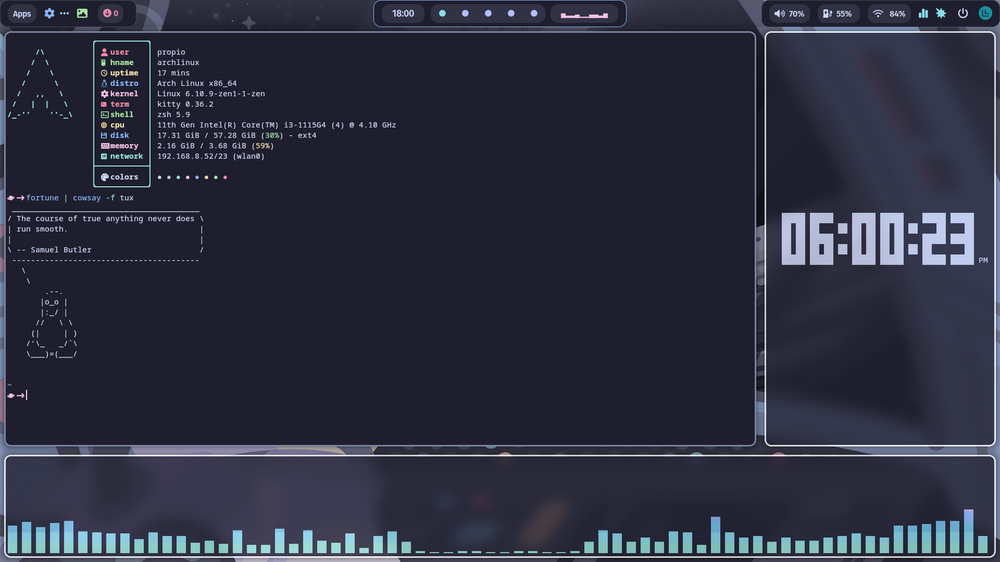

<h1 align="center">

</h1>

These are some of my dotfiles which depend on <a href="https://github.com/mylinuxforwork/dotfiles">ML4W dotfiles</a> by Stephan Raabe.I use catppuccin-mocha coulour scheme to theme it.

<h3 align="center">
Preview
</h3>

<h3 align="center">
Info
</h3>

These dotfiles have tweaked module:
- Clock -> `fixed wrong timezone with custome clock module.` 

And added new modules:
+ CPU temprature -> `Utilizes lm-sensors to display temprature since normal temprature module is a bit broken.`

Wallpaper can be found at <a href="https://github.com/42Willow/wallpapers">Willow's wallpaper dump</a>.
I am using Kitty terminal  with catppuccin-mocha colours since it comes out of the box.
Any folder with "(copy-contents)" requires you to copy the files inside the folder as the folder in the original folder in the ML4W filesystem is symlinked.*For catppuccin mocha the folder should be copied to `~/.config/waybar/themes`.

Many thanks to Stephan Raabe for creating the ML4W dotfiles.

